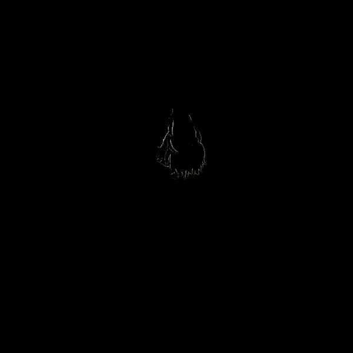
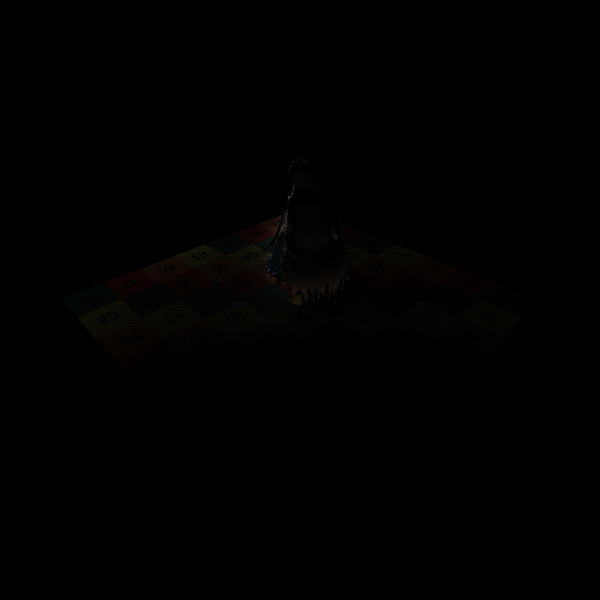
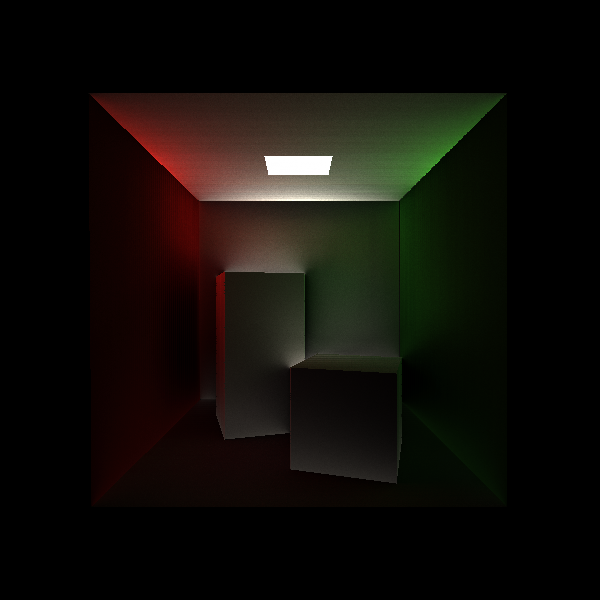

# 基于CPU模拟的实时软光栅渲染器

### 介绍

​	实时软光栅渲染器基于C++开发，实现了光栅化渲染管线（顶点装配->顶点着色器->图元组装->光栅化->片段着色器）基本流程，同时依据games101、games202图形学理论实现了**正交/透视投影**、**属性插值与透视投影矫正**、**深度测试**、**Blinn-Phong光照模型**、**法线/凹凸/位移贴图**、**two-pass shadowmap硬阴影/软阴影**（Hard、PCF，PCSS）、**延迟渲染**、**屏幕空间环境光遮蔽SSAO**、**屏幕空间全局光照SSDO**、**屏幕空间光线追踪SSR及其加速结构**（Depth-Mipmap）。该渲染器暂未使用预计算方法，支持动态光源和动态场景，可通过键鼠输入实时改变光源位置、物体位置和摄像机位姿。Openrenderer只是为学习理解硬件渲染管线所做，项目仍需完善补充，未来将持续更新。

### 快速使用

- 测试环境

```
CPU: AMD R5-4800H

操作系统：Windows11/Ubuntu2204

编译器：MinGW-w64(gcc/g++),MSVC,Clang
```

- 编译

```
git clone https://gitee.com/xingheguntangxi/openrenderer.git
cd openrenderer
mkdir build && cd build
cmake ..
cmake --build . -j
```

- 运行

​	编译生成的可执行文件存放在build/bin/目录下，运行前注意更改文件路径。本项目使用.json配置文件加载模型场景，预先提供Marry场景和cornellbox场景。

### 效果

- Two-pass rendering 光源视角深度图

<center class="half">
	
    
</center>


- 延迟渲染 gbuffer（position+depth+normal+albedo）
  <center class="half">
  	
  	
      
      
  </center>
  
  <center class="half">
    	
    	
    	
    	
  </center>
- shadowmap（Hard+PCF+PCSS）

<center class="half">
	
	
    
</center>

- SSR加速结构：min-depth mipmap

<center class="half">
	
	
    
    
	
    
</center>


- 屏幕空间全局光照（SSAO+SSDO+SSR）

<center class="half">
	
	
    
</center>

<center class="half">
	
	
    
</center>

- 法线/凹凸贴图

<center class="half">
	
	
    
</center>

<center class="half">
	
	
    
</center>


### 实时渲染

#### 基础Blinn-Phong模型

<video width="400" height="400" src="./results/marry_phong.mp4"  autoplay="autoplay" preload="none" controls="controls"></video>

#### 特效全开（PCSS软阴影、SSAO、SSDO）

<video width="400" height="400" src="./results/marry_all.mp4"  autoplay="autoplay" preload="none" controls="controls"></video>

#### 屏幕光线追踪

- 采样数=1

<video width="400" height="400" src="./results/cornellbox_ssr1.mp4"  autoplay="autoplay" preload="none" controls="controls"></video>

- 采样数=16

<video width="400" height="400" src="./results/cornellbox_ssr16.mp4"  autoplay="autoplay" preload="none" controls="controls"></video>
